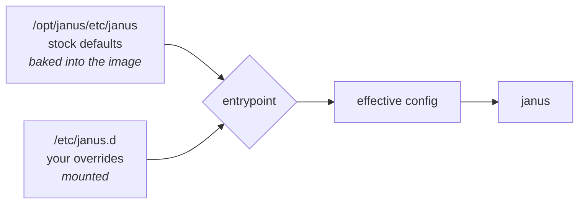

# Configuration

Janus is configured by a set of `.jcfg` files. This image ships Janus's **stock
defaults** and layers your changes on top, so a deployment only carries the files
it actually modifies.

## How layering works

At startup the entrypoint copies every `.jcfg` in `/etc/janus.d` over the
matching file in `/opt/janus/etc/janus`, then starts Janus.



```yaml
volumes:
  - ./conf.d:/etc/janus.d:ro
```

Files you do not provide keep their stock values. Nothing else is needed -
no templating, no environment substitution.


## Changing a setting

**1. Extract the default you want to change.**

```bash
docker run --rm ghcr.io/texttechnologylab/janus-gateway:1.4.2 \
    cat /opt/janus/etc/janus/janus.jcfg > conf.d/janus.jcfg
```

**2. Edit it.** The settings that usually need changing are listed
[below](#settings-that-usually-need-changing).

**3. Restart.**

```bash
docker compose restart janus
docker compose logs janus | grep "applied override"
```

The entrypoint logs each file it applies. If your file is not listed, it was not
picked up - check the filename and the mount.

!!! tip "Filenames must match exactly"
    An override is matched to a default by filename. `janus.plugin.videoroom.jcfg`
    works; `videoroom.jcfg` does not. The entrypoint warns when an override
    matches no shipped config, which catches most typos:

    ```
    janus-entrypoint: WARNING 'videoroom.jcfg' matches no shipped config
    ```

!!! warning "Janus does not reload configuration"
    Changes take effect on restart only, and a restart drops every call in
    progress. Never restart a gateway carrying live sessions.

## Which files exist

| File | Controls |
|---|---|
| `janus.jcfg` | Core: ICE, NAT, media, ports, logging. **The one you almost always override** |
| `janus.plugin.videoroom.jcfg` | SFU video rooms - bitrates, static room definitions |
| `janus.plugin.textroom.jcfg` | Data-channel text rooms |
| `janus.plugin.audiobridge.jcfg` | Audio mixing rooms |
| `janus.plugin.streaming.jcfg` | Streaming mountpoints |
| `janus.plugin.*.jcfg` | One per plugin - see [Plugins](plugins.md) |
| `janus.transport.websockets.jcfg` | WebSocket API (port 8188) |
| `janus.transport.http.jcfg` | HTTP API (port 8088) |
| `janus.eventhandler.*.jcfg` | Event handlers |

List what the image actually carries:

```bash
docker run --rm ghcr.io/texttechnologylab/janus-gateway:1.4.2 \
    ls /opt/janus/etc/janus/
```

## Settings that usually need changing

All in `janus.jcfg` unless noted. Stock values shown.

### Networking and NAT - the ones that break deployments

| Setting | Stock | Change it when |
|---|---|---|
| `nat_1_1_mapping` | *(unset)* | **The host is behind 1:1 NAT.** Set it to the public IP |
| `keep_private_host` | *(unset)* | Set `false` alongside `nat_1_1_mapping` to suppress the private address in SDP |
| `interface` | *(unset)* | Bind ICE to a specific interface (`ip -br addr`) |
| `ice_enforce_list` | *(unset)* | Restrict candidate gathering to that interface |
| `ice_ignore_list` | `vmnet` | Exclude virtual interfaces |
| `rtp_port_range` | `20000-40000` | Narrow it to what your firewall opens |

!!! danger "`nat_1_1_mapping` is the single most common cause of 'connects but no media'"
    Without it, a host behind NAT advertises its **private** address in SDP.
    Everything looks healthy - Janus starts, the API answers, clients attach and
    negotiate - and then no media ever arrives. If it holds a stale IP the
    symptom is identical. Check it first, every time.

### TURN

| Setting | Stock | Notes |
|---|---|---|
| `turn_server` / `turn_port` | *(unset)* | Server-side TURN, so Janus itself can gather relay candidates |
| `turn_type` | `udp` | |
| `turn_user` / `turn_pwd` | *(unset)* | |

!!! note "Server-side TURN is separate from client-side TURN"
    Configuring `turn_server` here does **not** give your clients relay
    candidates - they have their own ICE configuration. Setting only one produces
    a one-directional failure that is painful to diagnose. Configure both.

### Reliability

| Setting | Stock | Notes |
|---|---|---|
| `full_trickle` | *(unset)* | `true` speeds up connection setup |
| `dtls_timeout` | `500` | Raise (1000–1500) when clients are on congested wifi - mobile and standalone VR devices lose the handshake at the default |
| `ipv6` | *(unset)* | `true` for dual-stack clients |

### Logging

| Setting | Stock | Notes |
|---|---|---|
| `debug_level` | `4` | `0`–`7`. Raise to `6` while stabilising, lower once stable |
| `debug_timestamps` | *(unset)* | `true` is worth it in containers |

### Media plugins

| Setting | File | Stock | Notes |
|---|---|---|---|
| `bitrate` | `janus.plugin.videoroom.jcfg` | `128000` | Per-room cap. The default is low - raise it for a legible view of a face |
| `record` / `rec_dir` | `janus.plugin.videoroom.jcfg` | `false` | Recording is normally toggled at runtime instead. See [Recordings](recordings.md) |

## Ports

Set in the transport configs, not `janus.jcfg`.

| Port | Transport | Stock |
|---|---|---|
| `8188` | WebSocket API | enabled |
| `8088` | HTTP API | enabled |
| `7188` / `7088` | Admin API | disabled |
| `20000-40000/udp` | RTP/ICE | `rtp_port_range` |

!!! note "TLS is normally terminated in front of Janus"
    `wss` and `https` are disabled by default. Most deployments put a reverse
    proxy in front and leave Janus speaking plain ws/http on the loopback or a
    private interface. If you do, the proxy **must** forward `Upgrade` and
    `Connection` headers and allow a long read timeout, or clients will connect
    and then drop seconds later.

## Alternative: mounting individual files

If you would rather not use the override directory, bind-mount files directly
over the defaults:

```yaml
volumes:
  - ./janus.jcfg:/opt/janus/etc/janus/janus.jcfg:ro
```

This works and skips the entrypoint's copy step.

!!! warning "Do not mount the whole config directory read-only"
    ```yaml
    - ./conf:/opt/janus/etc/janus:ro   # replaces every default
    ```
    This hides **all** stock configs, so you must supply every file Janus needs,
    and it makes the override directory unusable because the entrypoint can no
    longer write there. Mount individual files, or use `/etc/janus.d`.

## Verifying the effective configuration

```bash
# what Janus actually loaded
docker compose exec janus cat /opt/janus/etc/janus/janus.jcfg

# which overrides were applied at startup
docker compose logs janus | grep "applied override"

# version, plugins and transports actually in use
curl -s http://localhost:8088/janus/info | head -c 400
```
